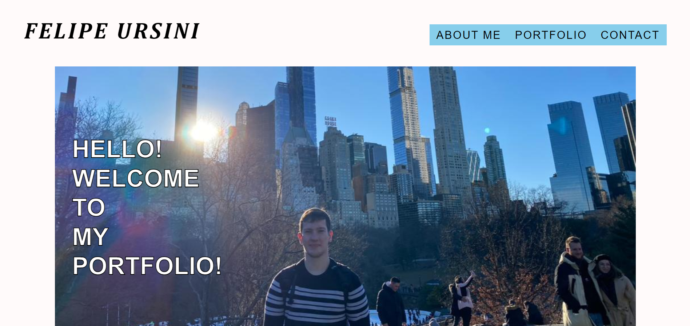
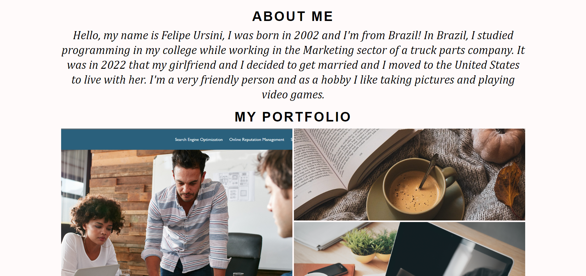

# My Portfolio Challenge

## Description

In this project we had the challenge of creating a portfolio using only HTML and advanced CSS (such as media queries, flexbox and other CSS functions).
The portfolio must include the Developer`s name, a recent photo, an "About Me" section, a showcase of work and contact infos! The links in navigation must scroll to corresponding section, the primary portfolio image must be larger than others and linked to deployed projects, and also the website needs to be responsive on various screens and devices.

## Deployed Application Link

https://usflfelipe.github.io/portfolio-challenge/

## Screenshot

